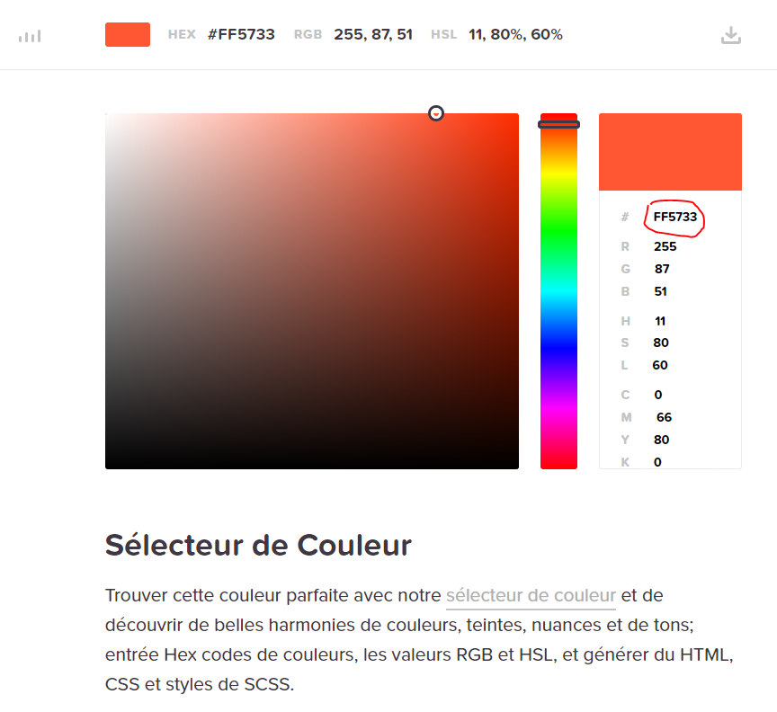

# Changer la couleur de votre site

Dans notre page **CSS** pour le moment nous avons uniquement utiliser les couleurs pré-enregistré dans le css avec exemple :
````
h1{
  color : red;
}
````
D'autres couleurs sont également disponible, pour cela rendez-vous sur le site suivant 


[https://htmlcolorcodes.com/fr/](https://htmlcolorcodes.com/fr/)

Copier le code de la couleur que vous avez choisi (entourer en rouge dans l'image suivante)



Vous pouvez avec ce code modifier toutes les couleurs de votre site de la façon suivante 

````
h1{
  color : #FF5733;
}
````

# [Suite : Les listes](LISTE.md)
