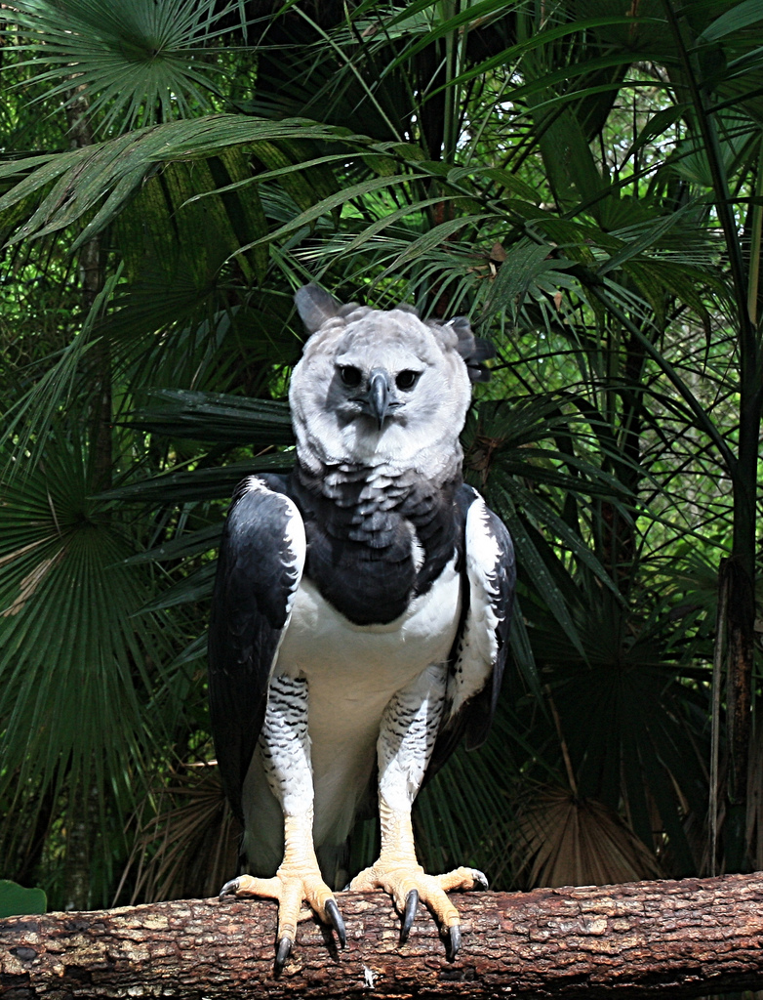

# Ajouter des page dans votre site

Pour faire xune nouvelle page, dans Notepad++ allez dans File, New (ou Fichier nouveau) et engregistrez la page (Save As, ou Enregistrersous), et donnez lui pour nom ````page2.html````. 
Vous pouvez maintenant lui rajouter le code minumum que vous pouvez retrouvez ici : [code Minimum](./MINI.md)


Nous allons maintenant ajouter du contenu à notre page :

Rajoutez comme titre principale :

Harpie féroce

avec un paragraphe :

La harpie féroce (Harpia harpyja), seule espèce du genre Harpia, aussi connue au Brésil sous le nom de faucon-royal (en portugais : gavião-real), est un aigle forestier d'Amérique latine. C'est le plus grand et le plus puissant rapace de la forêt tropicale et il figure parmi les plus grandes espèces d'aigles dans le monde. La harpie vit habituellement dans les forêts tropicales humides des basses terres, dans la couche supérieure de la canopée. La destruction de son habitat naturel réduit fortement son aire de répartition : elle a presque disparu d'Amérique centrale1.

Nous allons ajouter l'image suivante, elle se nomme : harpie_feroce.jpg



Un titre secondaire : 

Description

Un sous titre :

Morphologie

Et un dernier paragraphe

La harpie féroce peut mesurer jusqu'à un mètre, avec une envergure pouvant dépasser les deux mètres, et un poids compris entre quatre et neuf kilogrammes2. Son espérance de vie est d'environ 40 ans3. Le dessus du poitrail est noirâtre et contraste avec la couleur blanche située juste en dessous. Sa tête blanche est surmontée d'une crête érectile noirâtre sur l'occiput4. Son bec bleu-noir est extrêmement puissant, tout comme ses pattes jaunes, dont le dessus est strié de bandes noires et dont la griffe du doigt postérieur peut atteindre six centimètres. Ses ailes sont longues et arrondies5. La harpie féroce est considérée comme le plus grand aigle d'Amérique du Sud. Les harpies féroces mesurent de 86,5 à 107 cm et possèdent une envergure de 176 à 224 cm. Parmi les mensurations standard de cet oiseau, la corde de l’aile mesure 54-63 cm, la queue mesure 37-42 cm, le tarse a une longueur de 11,4-13 cm et la taille du culmen est de 4,2 à 6,5 cm.


