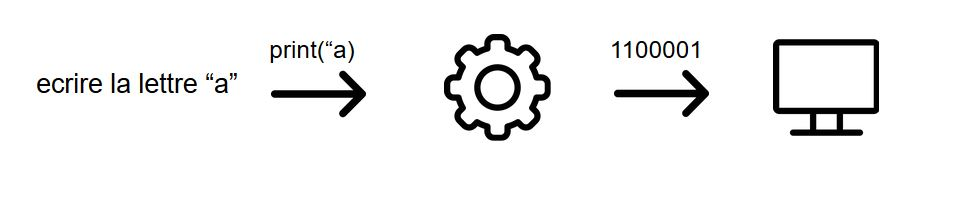
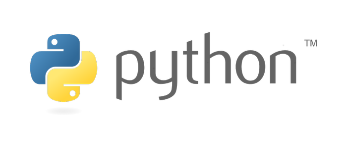

# Les langages de programmation

Un langage de programmation est un langage destiné à produire des programmes informatiques. La difficulté c’est qu’un ordinateur ne comprend que des 1 et des 0. Pour cela il faut utiliser un “traducteur”, c’est là que le langage de programmation entre en jeu. Le programme va comprendre ce qu’on lui demande, et le convertir en 0 et 1 compréhensible par l’ordinateur.

Au cours de l’année nous allons utiliser le langage python. Le langage Python est placé sous une licence libre, ce qui veut dire que le langage peut être utilisé avec pas ou peu de restriction vis-à-vis de l’auteur de ce langage. Il fonctionne sur la plupart des plates-formes informatiques, des smartphones aux ordinateurs de Windows à Unix avec notamment GNU/Linux en passant par macOS, ou encore Android, iOS,

# [SUITE : Les Variables](./VARIABLES.md)
