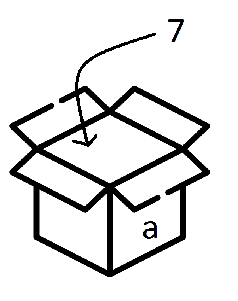

# Les Variables

Dans un programme il faut enregistrer des données (le temps que le programme s'exécute) nécessaires au traitement des tâches.
Une variable désigne donc un emplacement de stockage dans la mémoire de l’ordinateur. 
On peut la comparer à une boîte dans laquelle on range des valeurs.

Une variable est définie par un nom que le programmeur lui attribue.

Une variable est toujours écrite en minuscule. Il ne peut pas y avoir d'espace dans le nom d'une variable donc si le nom comporte plusieurs mots dans ce cas on les sépare par _ (tiret du 8).

### exemple : 
nom_variable

Pour affecter une valeur à une variable (mettre une valeur dans l'emplacement mémoire correspondant à notre variable) il faut ajouter le signe = 

### exemple : 
je veut affecter la valeur 7 à une variable que j'ai nommé a

````python
a = 7
````




# [SUITE : Les types](./TYPES.md)
