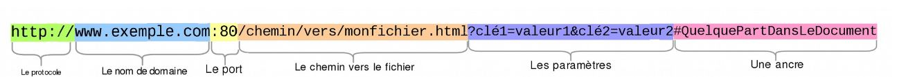

# Url pour aller plus loin

Nous avons vu la forme la plus simple d'une URL mais celui-ci peut être plus compliqué

Le protocole, le nom de domaine et le chemin ça ne change pas.
  
ici :80. Il indique le port utilisé sur le serveur web. (La porte pour accéder à la ressource)  
Généralement le port n'est pas indiqué car le navigateur utilise le port par défault (80 pour Http, 443 pour Https)  
  
---
### A Noter dans le cours
---
Les paramètres sont données supplémentaires fournis au serveur web. Ces paramètres sont construits sous la forme d’une liste de paires de clé/valeur dont chaque élément est séparé par une esperluette (&). Grace à ses paramètres le serveur web peut effectuer des action avant d'envoyer la ressource. Les paramètres commence par '?'. Leurs fonctionnement dépend du serveur web
  
Une ancre, désigne un endroit donnée dans la ressource, cela permet d'afficher une page à un endroit précis de celle-ci  
  
# [Exercices](https://forms.gle/KzZQqJLWw69Z14x89)
